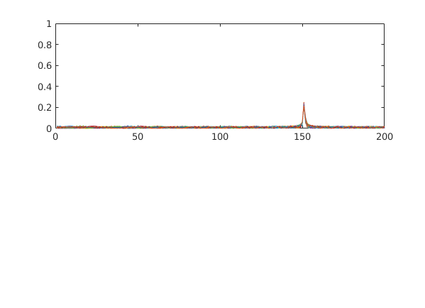
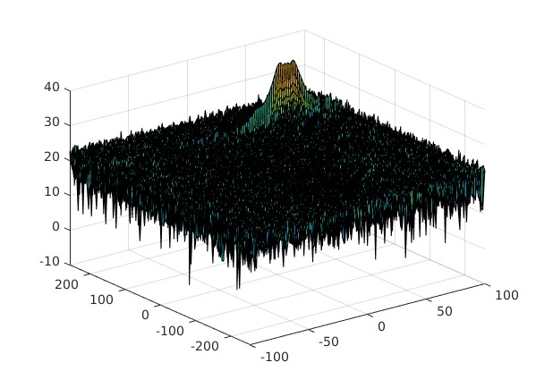
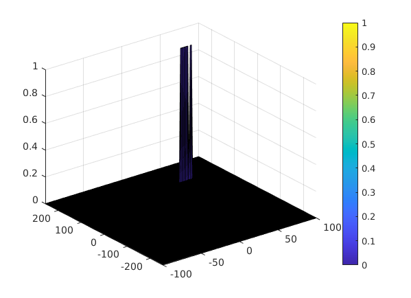

# Radar Target Generation and Detection


1. FMCW Waveform Design

    From line **#34** to line **#36**, I have calculated the Bandwidth (B), Chirp Time (Tchirp) and Slope (slope) of the FMCW chirp using the above requirements.

    Target's initial position and velocity are defined as follows:
    - target_position = 150 meter
    - target_velocity = 55 m/s

2. Range FFT (1st FFT)

    The steps to solve the task:
    - Implement the 1D FFT on the Mixed Signal
    - Reshape the vector into Nr*Nd array.
    - Run the FFT on the beat signal along the range bins dimension (Nr)
    - Normalize the FFT output.
    - Take the absolute value of that output.
    - Keep one half of the signal
    - Plot the output
    - There is a peak at the initial position of the target

    The code implementation of this part is from line **#38** to line **#150**.

    Results:

    

    


3. 2D CFAR

    The steps to solve the task:
    - Determine the number of Training cells and the number of guard cells for each dimension.

    ```
    Tr = 10;
    Td = 8;

    Gr = 4;
    Gd = 4;

    offset = 1.4; % in dB
    ```

    - Slide the cell under test across the complete matrix. Make sure the CUT has margin for Training and Guard cells from the edges.
    - For every iteration sum the signal level within all the training cells. To sum convert the value from logarithmic to linear using db2pow function.
    - Average the summed values for all of the training cells used. After averaging convert it back to logarithmic using pow2db.
    - Further add the offset to it to determine the threshold.
    - Next, compare the signal under CUT against this threshold.
    - If the CUT level > threshold assign it a value of 1, else equate it to 0.
    - Steps taken to suppress the non-thresholded cells at the edges:
    ```
    RDM(union(1:(Tr+Gr),end-(Tr+Gr-1):end),:) = 0;  % Rows
    RDM(:,union(1:(Td+Gd),end-(Td+Gd-1):end)) = 0;  % Columns
    ```

    The code implementation of this part is from line **#156** to line **#257**.

    Results:

    
